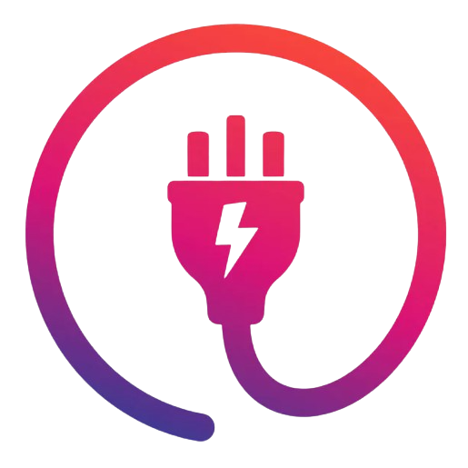
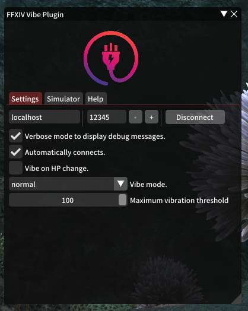

# FFXIV Vibe Plugin

  

  

A plugin for FFXIV that will let you vibe your controller or toys.

## Features
- Easy UI interface.
- Connect your device (manually or automatically).
- Trigger some pattern from chat message.
    - Custom chat selection.
    - Custom allowed characters.
- Trigger some pattern from spells.
    - Custom spell name.
    - Custom spell type (damage, heal...).
    - Custom spell direction (outgoing, incoming, self).
- Multiple devices per custom trigger.
- UI to search through your triggers.
- Delay start and stop patterns.
- Custom device and motors.
- Using RegExp for chat messages and spell names.
- Define global threshold or threshold per motor.
- Displaying battery life of devices.
- Custom patterns per motor (save, with easy import, export).

## Prerequisites
- [FFXIV QuickLauncher](https://github.com/goatcorp/FFXIVQuickLauncher).
- [Intiface Desktop](https://intiface.com/desktop/)

## Installation
1. Launch your game, open `/xlplugins`, go to the settings (bottom left) and in the `Experimental` tab.
2. Under `Custom Plugin Repositories` add the following url `https://raw.githubusercontent.com/kaciexx/FFXIV_Vibe_Plugin/master/repo.json` and press the <kbd>+</kbd> icon.
3. Press the `Save and close` button on the bottom left.

Now you should be able to see `FFXIV Vibe Plugin`. Click install and enjoy. 

## How to use
1. Start `Intiface` and click on `Start Server`. Power on your device, make sure it is connected to Intiface.
2. In the game. Type: `/fvp`. You should see the configuration panel.
3. Press the `Connect` button.

Well done ! 

You have now FFXIV connected to Intiface. Now you can connect your device to Intiface and you
should be able to use them with FFXIV Vibe Plugin.

## Our TODO
Our current ideas and feedbacks are in: [TODO List](./TODO.md)

## Build yourself
You can build yourself, instructions are here: [Build yourself](./BUILD.md)

## Tested devices
- Microsoft XBox Controller
- Lovense (*please use bluetooth and not the lovense dongle*): 
    Nora, Hush, Domi, Ferri, Diamo, Edge 2, Gush

## FAQ
### Troubleshooting
1. Make sure the addon is correctly extracted (check our tutorial again).
1. Make sure you have the [latest version](https://github.com/kacie8989/FFXIV_Vibe_Plugin/releases).
2. Upgrade your Intiface by clicking and installing any updates (`Settings` tab).
3. Make sure the Intiface is up and running. Go to `Server status` > `Start Server`. You must have one green icon and one red icon on the top right side of the window.
4. Ingame, make sure the addon is connected to Intiface. Click on `connect` (in the `Connect` tab). Now, go back to Intiface. You should have 2 green icons on the top right side of the window.

### My device is not working correctly
Please make sure to test both Bluetooth and the dongle of the device. Choose the one that works best for you.

### My X-Box Controller is not working well
This is not related to this plugin. You probably should not use Bluetooth.

### My Lovense Nora is not doing rotations
Please stop using Lovense Dongle. Connect using the Lovense Connect or bluetooth. If you don't have bluetooth
please buy a bluetooth 5.0 dongle on amazon for 20$. 

### The plugin does not connect to Intiface
Please make sure you are doing it right. 
1. Open Intiface and click on the top right side **red** icon.
2. Uncheck everything but not *WebSocket* and *Bluetooth*. WebSocket should have the following text: "on [All Interfaces]:12345"
3. Click on Start Server (now you should have one *green* icon and one *red* icon on the top right side).
4. Go to the plugin and click connect (you should have two *green* icons). 
If this is not working: please try change the IP Address to 127.0.0.1 or your computer IP Address. Also make sure the port
is 12345 or correspond to the one in Intiface.

### How do I share my configuration
You can copy/past the file located at: `%AppData%\XIVLauncher\pluginConfigs\FFXIV_Vibe_Plugin.json`.
Be aware: this will overrides everything.

# Discord
- [This plugin discord](https://discord.gg/JnCGxa3gGa) 
- [Ms. Tress #discussion](https://discord.gg/fx5pABsE)

# Donors
Please concider doing a small donation if you like this plugin. We work a lot and gave a lots of nights to design it, listening to everything people wanted.

Thanks to: Maple
