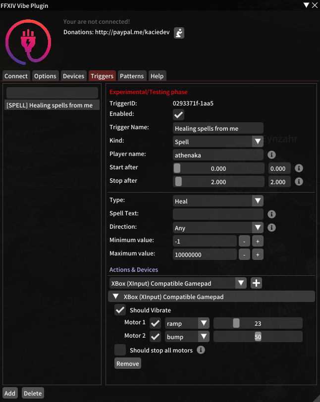

# FFXIV Vibe Plugin

  

  

A plugin for FFXIV that will let you vibe your controller or toys.

## Features
- Easy UI interface.
- Connect your device (manually or automatically).
- Trigger some pattern from chat message.
    - Custom chat selection.
    - Custom allowed characters.
- Trigger some pattern from spells.
    - Custom spell name.
    - Custom spell type (damage, heal...).
    - Custom spell direction (outgoing, incoming, self).
- Multiple devices per custom trigger.
- UI to search through your triggers.
- Delay start and stop patterns.
- Custom device and motors.
- Using RegExp for chat messages and spell names.
- Define global threshold or threshold per motor.
- Displaying battery life of devices.
- Custom patterns per motor (save, with easy import, export).

## Prerequisites
- [FFXIV QuickLauncher](https://github.com/goatcorp/FFXIVQuickLauncher).
- [Intiface Desktop](https://intiface.com/desktop/)
- [7-zip](https://www.7-zip.org/).
- Visual Studio 2019 if you want to compile.

## Our TODO
Our current ideas and feedbacks are in: [TODO List](./TODO.md)

## Installation

1. Download a [release here](https://github.com/kacie8989/FFXIV-Vibe-Plugin/releases)
(or clone this repository and build the project using Visual Studio 2019)
2. Go to FFXIV QuickLauncher folder (<kbd>WIN</kbd>+<kbd>R</kbd>, then `%appdata%\XIVLauncher\devPlugins`)
3. Extract the compressed file (eg: `FFXIV_Vibe_Plugin_v0.1.6.zip`) into FFXIV QuickLauncher `devPlugins` folder. You should have the following structure:

    - `C:\Users\<Username>\AppData\Roaming\XIVLauncher\devPlugins\FFXIV_Vibe_Plugin`.
    - The folder should contain some DLL files.

4. Start *FFXIV* using the **FFXIV QuickLauncher**
5. In game, type: `/xlplugins`. A red window should open. It's *Dalamud*, the plugin manage for FFXIV.
6. In Dalamud go to: `Developer tools` > `Plugins in developement` > `FFXIV Vibe Plugin`
7. Make sure the plugin is enabled
8. Type: `/fvp`. You should see the configuration panel.
9. Start `Intiface` and click on `Start Server`. Power on your device, make sure it is connected to Intiface.
10. Back in to the game, start the connect command: `/fvp connect`

Well done ! You have now FFXIV connected to Intiface and your toys. 

## Tested devices
- Microsoft XBox Controller
- Lovense (*please use bluetooth and not the lovense dongle*): 
    Nora, Hush, Domi, Ferri, Diamo, Edge 2, Gush

## FAQ
### Troubleshooting
1. Make sure the addon is correctly extracted (check our tutorial again).
1. Make sure you have the [latest version](https://github.com/kacie8989/FFXIV_Vibe_Plugin/releases).
2. Upgrade your Intiface by clicking and installing any updates (`Settings` tab).
3. Make sure the Intiface is up and running. Go to `Server status` > `Start Server`. You must have one green icon and one red icon on the top right side of the window.
4. Ingame, make sure the addon is connected to Intiface. Click on `connect` (in the `Connect` tab). Now, go back to Intiface. You should have 2 green icons on the top right side of the window.

### My device is not working correctly
Please make sure to test both Bluetooth and the dongle of the device. Choose the one that works best for you.

### My X-Box Controller is not working well
This is not related to this plugin. You probably should not use Bluetooth.

### My Lovense Nora is not doing rotations
Please stop using Lovense Dongle. Connect using the Lovense Connect or bluetooth. If you don't have bluetooth
please buy a bluetooth 5.0 dongle on amazon for 20$. 

# Discord
- [This plugin discord](https://discord.gg/JnCGxa3gGa) 
- [Ms. Tress #discussion](https://discord.gg/fx5pABsE)

# Donors
Please concider doing a small donation if you like this plugin. We work a lot and gave a lots of nights to design it, listening to everything people wanted.

Thanks to: Maple
