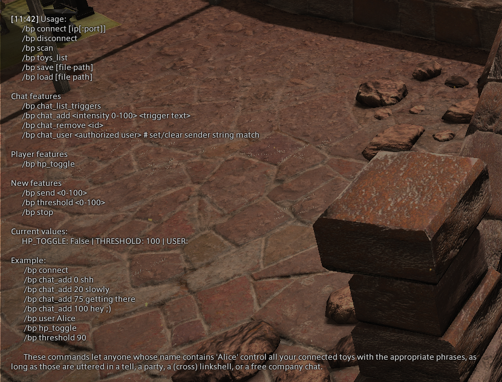

# FFXIV Buttplug

A buttplug plugin for FFXIV that will change the intensity of your toys when a word from the /freecompany is matched.

Credits: I have not done this plugin. It was initialy done by 
[Ms. Tress](https://discord.com/channels/793663567424520194/793663567865970701/793673706411917363) and updated by [Coranila](https://github.com/crnilaaaa/SamplePlugin).
I have only tried to document the installation process which took me multiple attempts and hours to make it work.

## Prerequisites
- [FFXIV QuickLauncher](https://github.com/goatcorp/FFXIVQuickLauncher).
- [7-zip](https://www.7-zip.org/).
- Visual Studio 2019 if you want to compile.
- [Intiface Desktop](https://intiface.com/desktop/)


## Installation

1. Download a [release here](https://github.com/kacie8989/FFXIV_BP/releases)
(or clone this repository and build the project using Visual Studio 2019)
2. Go to FFXIV QuickLauncher folder (<kbd>WIN</kbd>+<kbd>R</kbd>, then `%appdata%\XIVLauncher\devPlugins`)
3. Extract the compressed file (eg: `ffxiv-bp-v0.0.3.7z`) into FFXIV QuickLauncher `devPlugins` folder. You should have the following structure:

    - `C:\Users\<Username>\AppData\Roaming\XIVLauncher\devPlugins\FFXIV_BP`
    - The folder should contain ~30 dlls

4. Start *FFXIV* using the **FFXIV QuickLauncher**
5. In game, type: `/xlplugins`. A red window should open. It's *Dalamud*, the plugin manage for FFXIV.
6. In Dalamud go to: `Developer tools` > `Plugins in developement` > `Buttplug Triggers`
7. Make sure the plugin is enabled
8. Type: `/buttplugtriggers`. You should see a list of commands.
9. Start `Intiface` and click on `Start Server`. Power on your toy, scan toys and make sure it is connected to Intiface.
10. Back in to the game, start the connect command: `/buttplugtriggers connect`

Well done ! You have now FFXIV connected to Intiface and your toys. 



## Quick guide to make it work

| Command                | Description  |
|------------------------|--------------|
| /bp | List all the available commands |
| /bp connect [ip[:port]] | Connect to Intiface |
| /bp disconnect | Disconnect from Intiface |
| /bp scan | Force re-scanning |
| /bp toys_list | List all the toys that are connected |
| /bp save [file path] | Save the current configuration |
| /bp load [file path] | Load a configuration |
| /bp chat_list_triggers | List all the added words and intensity. |
| /bp chat_add <intensity 0-100> <The words to match> | Add a word that will trigger update the intensity of the toy. |
| /bp chat_remove <id> | Remove a word from the list. |
| /bp chat_user <username> | Triggered only by the define username. |
| /bp hp_toggle | Will vibe when some HP are missing. |
| /bp send <0-100> | Sends some vibes to the toys |
| /bp threshold <0-100> | Will pet to feel it to strongly. |
| /bp stop | Stop the toys (basically sending zero intensity). |

### Examples

```
/bp connect
/bp add 20 hello world
/bp add 0 stop
/bp add 100 lol
/bp user Alice           <==== Only names matching "...Alice..." will be able to control you. 
/bp hp_toggle
/bp threshold 50
```

Now open the FFXIV chat texbox, select the /freecompany channel and write: `hello world`.

Enjoy :)
                               
## Tested toys
                               
- Lovense Hush
- Lovense Domi
- Lovense Ferri
- Lovense Diamo
- Lovense Edge 2

# Discord

[Ms. Tress #discussion](https://discord.gg/fx5pABsE)
